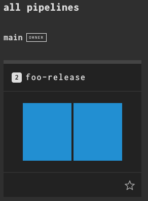
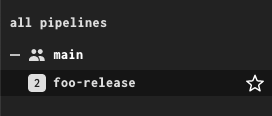
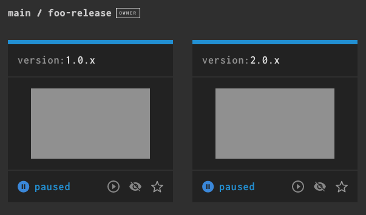

# Concourse incomplete primer

See

- [README](../README.md) for how to login into Concourse with `fly`.
- [scripts](../scripts) for interesting scripts (using Vault, ...).

## Misc fly commands

Are the workers running?

```
$ fly -t main workers
name      containers  platform  tags  team  state    version  age
worker-1  0           linux     none  none  running  2.3      15m6s
```

What are the last builds?

```
$ fly -t main builds
id  name  status     start                     end                       duration  team  created by
1   1     succeeded  2021-05-15@11:48:51+0200  2021-05-15@11:49:31+0200  40s       main  system
```

## Run your first task

You can run individually each task that compose a pipeline. This can be useful in the following situations:

- when developing or testing code that is built by a pipeline that takes a lot of time to run or with a lot of jobs, to quickly run only what you want.
- when debugging or creating a pipeline, to focus on one piece at a time.

Contrary to whole pipelines or single jobs within a pipeline, running a task with `fly execute` doesn't show up in the Concourse UI, it is seen only in the output of `fly execute` itself.

We will be running the [ci/pipelines/02-two-tasks/task.yml](../ci/pipelines/02-two-tasks/task.yml) task:

```
$ fly -t main execute -c ./ci/pipelines/02-two-tasks/task.yml
executing build 42 at http://localhost:8080/builds/42
[...]
running sh -exc whoami
env

+ whoami
root
+ env
USER=root
SHLVL=1
HOME=/root
PATH=/usr/local/sbin:/usr/local/bin:/usr/sbin:/usr/bin:/sbin:/bin
PWD=/tmp/build/e55deab7
succeeded
```

## Set your first pipeline

The [ci/pipelines/01-hello-world/hello-world.yml](../ci/pipelines/01-hello-world/hello-world.yml) has one job and that job contains one embedded task.
Since the task is embedded, we can set this pipeline without the need to refer to a git repository.

Although this is quite an artificial example, it is as simple as it gets.

```
$ fly -t main set-pipeline -p hello-world -c ci/pipelines/01-hello-world/hello-world.yml
[...]
pipeline name: hello-world

apply configuration? [yN]: y
pipeline created!
you can view your pipeline here: http://localhost:8080/teams/main/pipelines/hello-world

the pipeline is currently paused. to unpause, either:
  - run the unpause-pipeline command:
    fly -t main unpause-pipeline -p hello-world
  - click play next to the pipeline in the web ui
```

Let's unpause it:

```
$ fly -t main unpause-pipeline -p hello-world
```

Now go to the web UI. It will show a grey box with the job name, `hello-job`. Grey means "pending". There are two ways to trigger the job: from the web UI or from the command-line.

Let's trigger from the command line AND at the same time let's "watch" (that is, stream the output to fly like it happened before with `fly execute`) it running. You can also verify that the job is also being show as running in the web UI.

List all the pipelines known to Concourse:

```
$ fly -t main pipelines
id  name         paused  public  last updated
1   hello-world  no      no      2021-05-15 15:00:58 +0200 CEST
```

List the jobs that compose the `hello-world` pipeline:

```
$ fly -t main jobs -p hello-world
name       paused  status  next
hello-job  no      n/a     n/a
```

Let's run it:

```
$ fly -t main trigger-job -j hello-world/hello-job --watch
started hello-world/hello-job #1
initializing
[...]
running echo Hello, embedded world!
Hello,  embedded world!
succeeded
```

## Set your second pipeline

The [ci/pipelines/02-two-tasks/two-tasks.yml](../ci/pipelines/02-two-tasks/two-tasks.yml) pipeline contains two tasks, one embedded in the pipeline itself (as in the previous example) and one loaded from a task file.

Although having external task files requires more setup, it has two advantages:

- the same task file can be reused in different pipelines (or in the same pipeline) by setting different parameters or input and output mappings (see the Concourse documentation for details).
- it allows the powerful workflow shown above with `fly execute`.

Since the pipeline refers to an external task file, we need to tell it where to find such file. To do so we use the Concourse git resource.

```
fly -t main set-pipeline -p two-tasks -c ci/pipelines/02-two-tasks/two-tasks.yml
[..]
pipeline name: two-tasks

apply configuration? [yN]: y
pipeline created!
you can view your pipeline here: http://localhost:8080/teams/main/
```

```
$ fly -t main unpause-pipeline -p two-tasks
```

This time, instead of using `fly`, start the jobs from the web UI, then go back to the terminal and use `fly builds` and then `fly watch` to see the build logs.

## Set your third pipeline and use your secrets

The [ci/pipelines/03-simple-s3/simple-s3.yml](../ci/pipelines/03-simple-s3/simple-s3.yml) is becoming a real-world pipeline:

* it gets S3 secrets from Vault
* it gets code and pipeline configuration from a git repository
* it pushes the artifacts to Minio S3

```
$ fly -t main set-pipeline -p simple-s3 -c ci/pipelines/03-simple-s3/simple-s3.yml
```

* As usual, unpause the pipeline and trigger the `hello-job`, either from the web UI or with `fly`.
* In the Minio web UI, have a look at bucket `concourse`, path `builds/simple-s3`.
* Do the same with the Minio CLI:
  ```
  $ mc ls concourse-minio/concourse/builds/simple-s3
  [2021-05-15 18:51:26 CEST]     6B gift-20210515165122
  ```
  ```
  $ mc cat concourse-minio/concourse/builds/simple-s3/gift-20210515165122
  hello
  ```

:-)

## Explore instanced pipelines

Concourse 7.4 brought instanced pipelines, which is a way to group together highly related pipelines, for example supporting multiple release branches for the same project.
See the [official documentation](https://concourse-ci.org/instanced-pipelines.html) for details.

Our sample pipeline is at [ci/pipelines/04-instanced-pipelines/instanced.yml](ci/pipelines/04-instanced-pipelines/instanced.yml).

Set the first pipeline, to release the versions in 1.x:

```
$ fly -t main set-pipeline -p foo-release \
    -c ci/pipelines/04-instanced-pipelines/instanced.yml \
    --instance-var version=1.0.x
```

Set the second pipeline (from the same pipeline configuration file), to release the versions in 2.x:

```
$ fly -t main set-pipeline -p foo-release \
    -c ci/pipelines/04-instanced-pipelines/instanced.yml \
    --instance-var version=2.0.x
```

Note that:
* the pipeline name stays the same: `foo-release`
* we pass the value for the variable `((version))` with the special flag `--instance-var`

In the UI, they appear as one pipeline, but with visual cues:



In the same spirit, they do not take space in the list view:



Clicking on them opens a new view:



## Two level vars interpolation for parametric secrets

This section is an approach to the question in https://github.com/concourse/concourse/discussions/8522.

Reference: pipeline [two-level-interpolation](../ci/pipelines/05-two-level-interpolation/two-level-interpolation.yml)

The task

```yaml
    - task: interpolation
      file: concourse-in-a-box/ci/pipelines/05-two-level-interpolation/task.yml
      params:
        ENV: ((env))
        COLOR: ((color))
        SECRET_1: ((secret-1-((env))-((color))))
        SECRET_2: ((secret-2-((env))-((color))))
```

Uses a two level vars interpolation.

For example if we do

```text
$ fly -t dev set-pipeline -p interpolation-staging-green \
  -c two-level-interpolation.yml \
  -y env=staging \
  -y color=green
```

We get:

```yaml
      SECRET_1: ((secret-1-staging-green))
      SECRET_2: ((secret-2-staging-green))
```

For a total of `T = S_N * E_N * C_N` combinations

where:

- S_N number of secrets
- E_N number of environments (2: prod and staging, or more)
- C_N number of colors (probably 2: blue and green)


Once we inject the secrets into Vault:

```
$ vault kv put /concourse/developers/secret-1-staging-green \
  value="I am secret 1 for staging green"
$ vault kv put /concourse/developers/secret-2-staging-green \
  value="I am secret 2 for staging green"
```

Running the job:

```
selected worker: worker-1
...
+ env
...
ENV=staging
COLOR=green
SECRET_1=I am secret 1 for staging green
SECRET_2=I am secret 2 for staging green
```


## Where to go from here

* https://concourse-ci.org/examples.html
